# EquivalenceClass

`EquivalenceClass` - множество равных друг другу элементов.

```c
/* src/include/nodes/pathnodes.h */
typedef struct EquivalenceClass
{
	pg_node_attr(custom_read_write, no_copy_equal, no_read, no_query_jumble)

	NodeTag		type;

	List	   *ec_opfamilies;	/* btree operator family OIDs */
	Oid			ec_collation;	/* collation, if datatypes are collatable */
	List	   *ec_members;		/* list of EquivalenceMembers */
	List	   *ec_sources;		/* list of generating RestrictInfos */
	List	   *ec_derives;		/* list of derived RestrictInfos */
	Relids		ec_relids;		/* all relids appearing in ec_members, except
								 * for child members (see below) */
	bool		ec_has_const;	/* any pseudoconstants in ec_members? */
	bool		ec_has_volatile;	/* the (sole) member is a volatile expr */
	bool		ec_broken;		/* failed to generate needed clauses? */
	Index		ec_sortref;		/* originating sortclause label, or 0 */
	Index		ec_min_security;	/* minimum security_level in ec_sources */
	Index		ec_max_security;	/* maximum security_level in ec_sources */
	struct EquivalenceClass *ec_merged; /* set if merged into another EC */
} EquivalenceClass;
```

Внутри себя он хранит не простые `Node *`, а структуры `EquivalenceMember` - не только само выражение (константа, столбец, функция ...), но и множество других вспомогательных полей.
Например, `em_is_const` - является ли выражение *псевдо*константным или `em_jdomain` - join domain, к которому выражение принадлежит (об этой важной сущности в другой раз).

Новый элемент добавляется в множество, если находим новое `mergejoinable` выражение (по типу `A = B`).
При необходимости мы можем смержить 2 EC в один новый или создать новые.
Также, могут быть и вырожденные множества - из единственного элемента.

Как уже сказал, в множестве могут быть самые разные элементы: столбцы, константы и т.д.
Например, запрос `SELECT * FROM a JOIN b ON a.x = b.x WHERE a.x = 10` создает множество `{a.x, b.x, 10}`, а этот `SELECT * FROM a JOIN b ON a.x + 1 = b.x WHERE a.x + 1 = 2` - `{a.x + 1, b.x, 2}`.

Первая часть логики планировщика (в `query_planner`) нацелена на обход дерева соединений и создания самих классов эквивалентности.
Это происходит в `query_planner` от функции `deconstruct_jointree` до `generate_base_implied_equalities`.

EquivalenceClass'ы вычисляются (создаются) в функции `deconstruct_jointree` (`src/backend/optimizer/plan/initsplan.c`).
Но дальше работа продолжается в `reconsider_outer_join_clauses`. Как можно догадаться из названия в ней мы обрабатываем выражения, которые являются условиями *внешних* соединений: LEFT/RIGHT/OUTER JOIN, т.е. всех не INNER JOIN.
Причина в логике объединения этих классов эквивалентности.

Когда мы создали все классы, то далее выводим новые условия из них. Например, из `a.x = b.x` и `b.x = c.x` выводим `a.x = c.x`.
Это происходит в `generate_base_implied_equalities`. Он последний в нашем списке.

Далее, рассмотрим каждый такой этап в отдельности.

Работа начинается в `deconstruct_jointree`. Ее логика разделена на 3 фазы:

1. `deconstruct_recurse` - проход по дереву JOIN'ов и создание списка из `JoinTreeItem`. Эта структура - обертка над каждым элементом из этого дерева, но с дополнительной информацией.

```c
typedef struct JoinTreeItem
{
	/* Fields filled during deconstruct_recurse: */
	Node	   *jtnode;			/* jointree node to examine */
	JoinDomain *jdomain;		/* join domain for its ON/WHERE clauses */
	struct JoinTreeItem *jti_parent;	/* JoinTreeItem for this node's
										 * parent, or NULL if it's the top */
	Relids		qualscope;		/* base+OJ Relids syntactically included in
								 * this jointree node */
	Relids		inner_join_rels;	/* base+OJ Relids syntactically included
									 * in inner joins appearing at or below
									 * this jointree node */
	Relids		left_rels;		/* if join node, Relids of the left side */
	Relids		right_rels;		/* if join node, Relids of the right side */
	Relids		nonnullable_rels;	/* if outer join, Relids of the
									 * non-nullable side */
	/* Fields filled during deconstruct_distribute: */
	SpecialJoinInfo *sjinfo;	/* if outer join, its SpecialJoinInfo */
	List	   *oj_joinclauses; /* outer join quals not yet distributed */
	List	   *lateral_clauses;	/* quals postponed from children due to
									 * lateral references */
} JoinTreeItem;
```

2. `deconstruct_distribute` - поочередно обрабатываем каждое выражение, сохраняем его для узла. Также если оно `mergejoinable` (в форме `X = Y`), то мы создаем новое, либо добавляем к существующему EC.

3. `deconstruct_distribute_oj_quals` - дополнительно обрабатываем условия для OUTER JOIN'ов.

На примере запроса `SELECT * FROM a JOIN b ON a.x = b.x WHERE a.x = 10`. Для создания этого множества будет пройден следующий путь.

1. После 1 этапа, мы получим следующий список из JoinTreeItem'ов (`item_list`)

    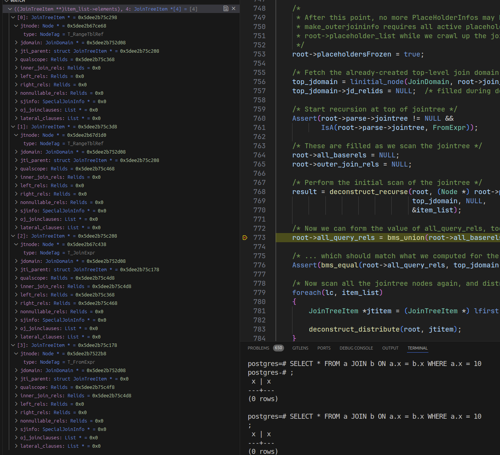

2. Далее, мы будем проходить по каждому элементу этого массива и распределять все qual. Всего у нас 4 элемента массива:
   - RangeTblRef - `a`
   - RangeTblRef - `b`
   - JoinExpr   - `JOIN`
   - FromExpr   - весь запрос с условием WHERE

3. Обновление EC происходит в функции `deconstruct_distribute` и только при обработке тех JTI, которые имеют условия (логично), но RangeTblRef их не имеют, поэтому их пропускаем.

4. Далее, мы обрабатываем JoinExpr. У нас имеется 1 условие JOIN'а - `a.x = b.x`. Мы обрабатываем его внутри `distribute_quals_to_rels` - в нем мы пробегаем по всем условиям и для каждого вызываем функцию `distribute_qual_to_rel`.

    Если посмотрим на переданные условия (все), то там окажется только это условие JOIN'а:

    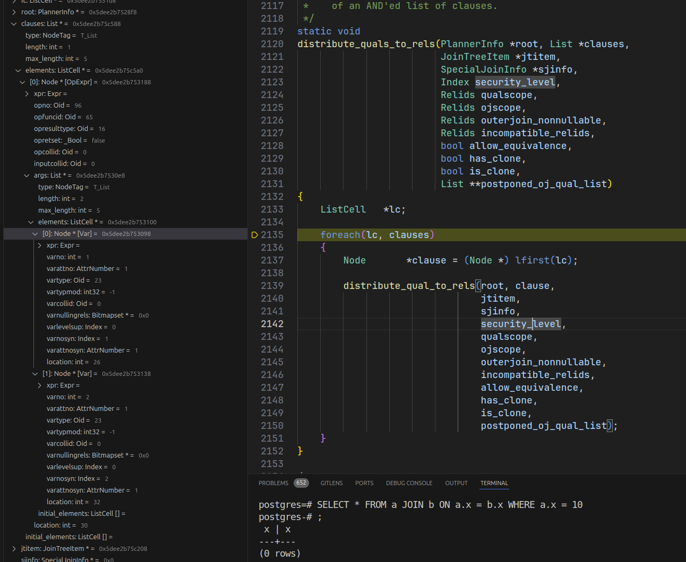

5. Спускаемся на уровень `distribute_qual_to_rels`. В начале мы пропускаем проверки на некоторые случаи (lateral запрос, outer join, var-free выражения и т.д.). И создаем `RestrictInfo` - представление выражения ограничения, далее работа планировщика будет вестись с этой структурой - в ней находится наше выражение `a.x = b.x` (обе структуры Var - столбцы)

    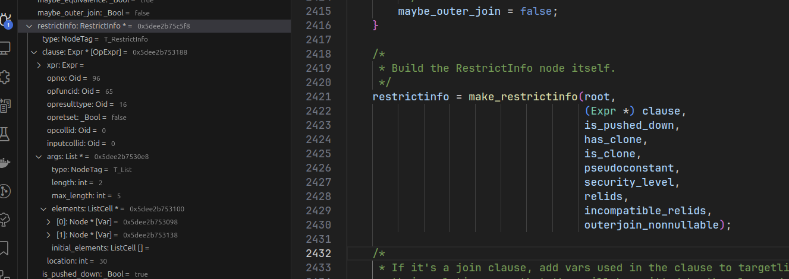

6. После создания проверяются некоторые свойства - в частности `mergejoinable` (внутри `check_mergejoinable` функции). Но это не простой флаг - это список из OID семейств операторов (`get_mergejoin_opfamilies`)

    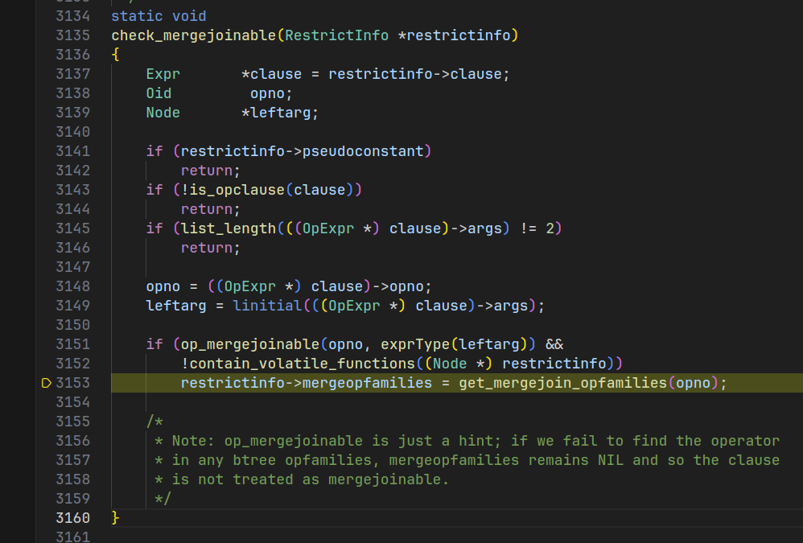

7. Мы нашли нужное семейство операторов. Так как в примере мы использовали `int` типы, то в этом списке будет OID 1976 - зарезервированный.

    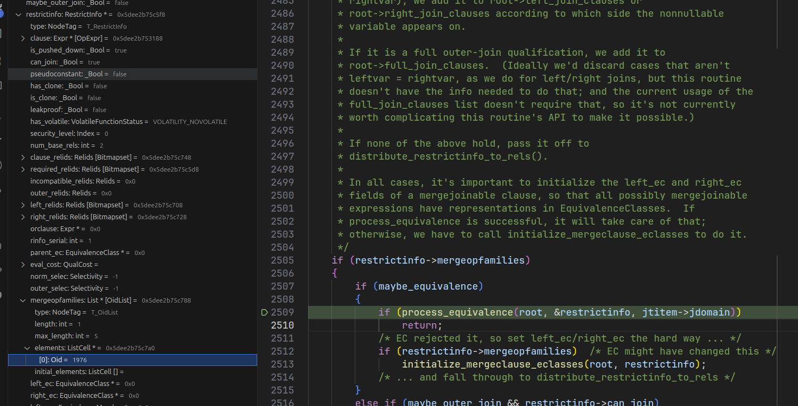

8. Доходим до главной функции - `process_equivalence`. Она просматривает `RestrictInfo` и *обновляет или создает EC*. Эта функция состоит из 2 частей: находим существующие EC и их обновление

9. Нахождение существующих EC - это 2 вложенных цикла: проходим по всем EC (`PlannerInfo->eq_classes`) и внутри каждого проходим по каждому члену множества и проверяем на равенство (`EquivalenceClass->ec_members`)

    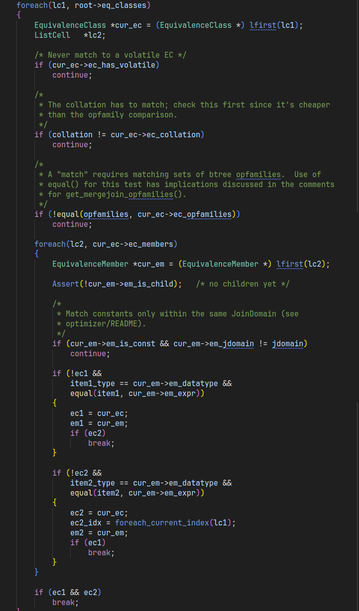

10. Когда мы их нашли, то на выбор у нас 4 варианта: NULL/NULL, ec1/NULL, NULL/ec2, ec1/ec2. Так как мы просматриваем эти столбцы первый раз, то наткнемся на 1 случай. Тогда, мы создадим новый EC в который добавим эти 2 элемента.

    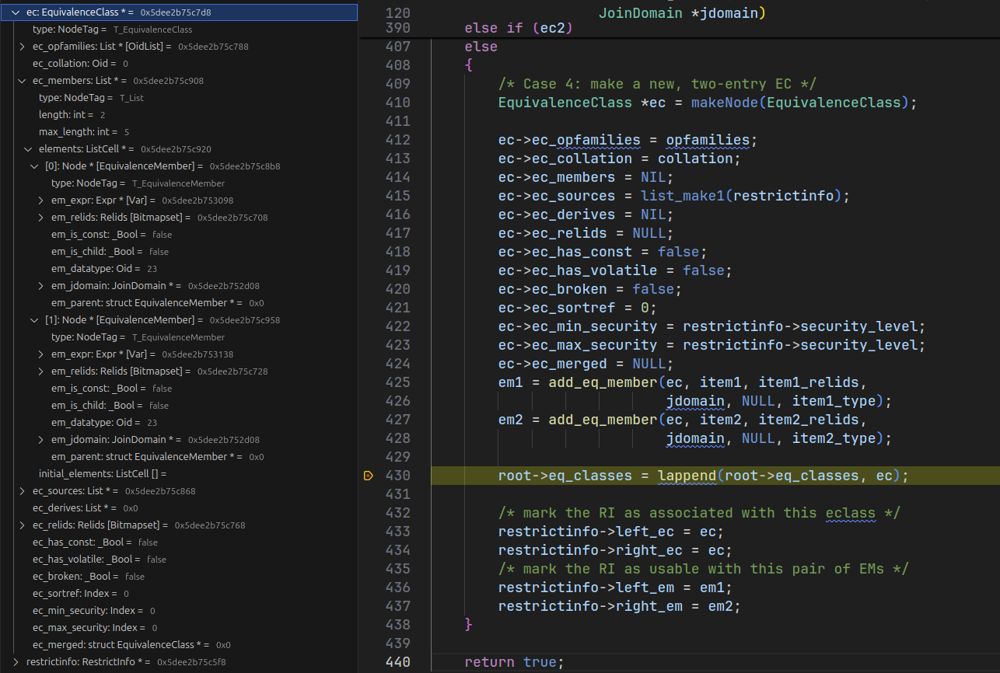

    На скриншоте можно заметить, что в этом множестве (список `ec_members`) содержатся 2 элемента - наши столбцы (`Var`).

    Также для более удобной работы мы сохраняем EC и EM в самом RI

11. После мы переходим к следующему `JoinTreeItem`. На этот раз - это `FromExpr`. Здесь мы будем работать с условиями `WHERE` (он этот узел их хранит). В нем мы должны обработать условие `a.x = 10`.

    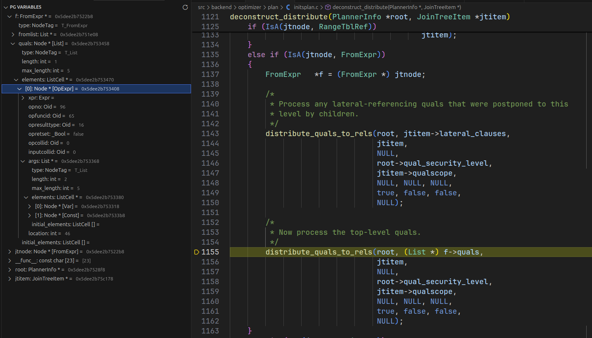

    На скриншоте показан список `quals` - условий в `WHERE`. В нем только 1 условие - столбец и константа

12. Далее, мы также проходим по всем шагам - так же как и для предыдущего условия. Эти части мы пропустим и остановимся в `process_equivalence` на месте, когда находим очередные EC для каждой части операндов.

    В нашем списке уже есть 1 EC. Когда мы будем обходить его члены, то найдем равный столбец:

    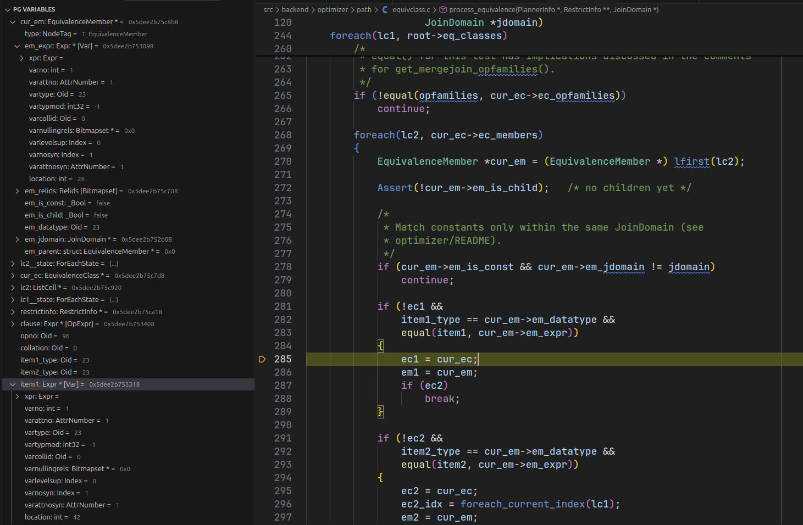

    На скриншоте можно видеть, что `item1` (левый операнд) и `cur_em->em_expr` (выражение текущего члена EC) указывают на один и тот же столбец (`varno`, `varattno`).

    Но вот дальше, проверка не пройдет, т.к. правый операнд - константа (на скриншоте виден тип узла).

13. В *тот* раз мы наткнулись на 1 случай (`NULL`/`NULL`), но теперь мы нашли EC (как минимум 1 не `NULL`). Тогда мы добавляем другой элемент (константу) в найденный EC

    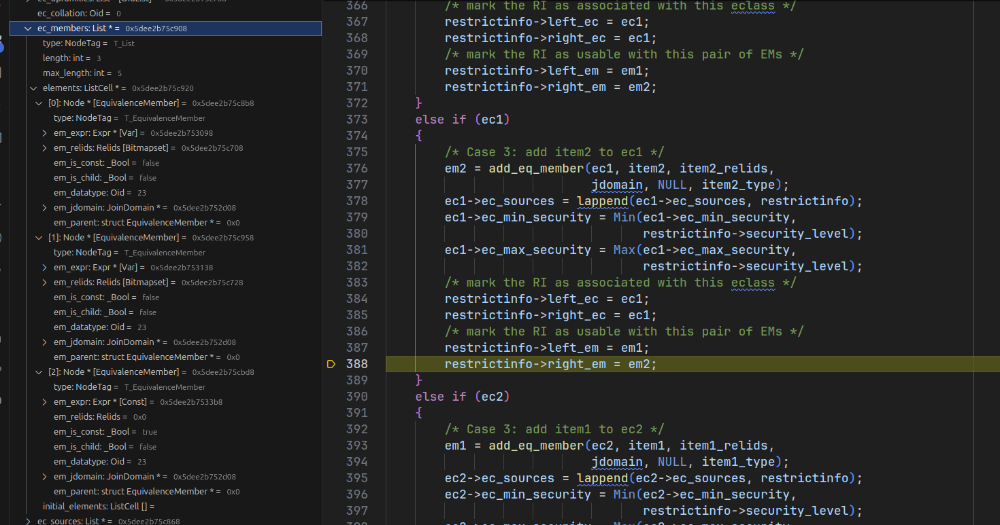

    На скриншоте видно, что в этом множестве теперь находится 3 элемента: 2 столбца и 1 константа.

14. Возвращаемся в `query_planner` и дальше по порядку `reconsider_outer_join_clauses`. Но его мы пропускаем т.к. у нас нет OUTER JOIN'ов, поэтому сразу переходим к `generate_base_implied_qualities`.
    Это и есть то место, где создается магия - выводятся все возможные условия с помощью классов эквивалентности.
    Его логика довольно прямолинейная - обходим все классы эквивалентности и в каждом выводим условия.
    Заходим в него и остановимся на первой (единственной, т.к. класс только 1) итерации цикла.
    Пройдем до первого `if`'а и увидим, что логика не одинаковая для каждого EC - она отличается в зависимости от того есть ли в EC константы или нет.
    Мы уже знаем, что в этом EC есть константа (`10`), поэтому спускаемся в него.

    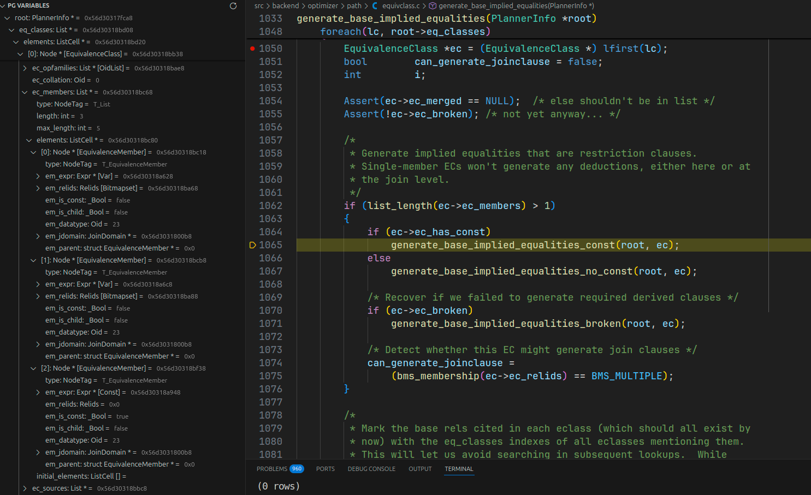

15. Внутри же логика проста - находим эту константу и создаем условия равенства с каждым оставшимся членом.
    В первом цикле мы находим константу. Этот EM будет последним в `ec_members`.

    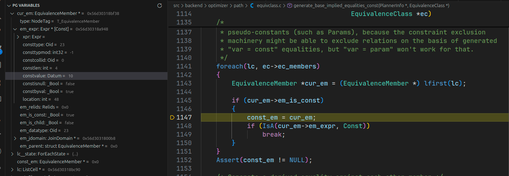

16. Далее, мы обходим каждый член множества и создаем условие с ним.
    Первый на очереди - `a.x`.
    Основная логика работы заключена в функции `process_implied_equality`

    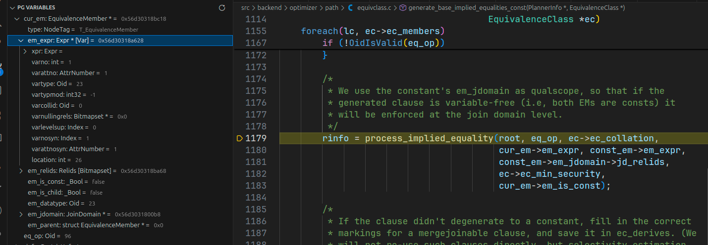

    > Можете заметить, что это условие мы не вывели, а воссоздали, т.к. оно и так было в запросе изначально

17. Спускаемся внутрь и доходим до вызова `distribute_restrictinfo_to_rels` (почти конец).
    На этом моменте мы уже создали выражение, которое и будет использоваться планировщиком.
    Как мы и предполагали, это `a.x = 10`

    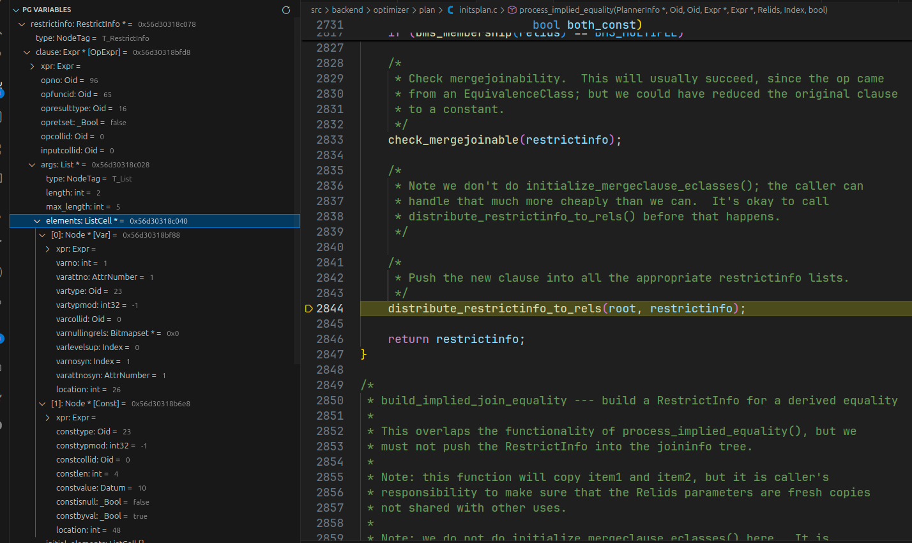

18. Спускаемся внутрь и видим, что эта функция определяет какие отношения участвуют в условии и кладет им это условие.
    Всего может быть 2 варианта - JOIN CLAUSE (для соединений отношений) и RESTRICTION CLAUSE (для фильтрации данных).
    И отличаются они тем, что во 2-ом условии используется только 1 отношение, а в 1-ом сколько угодно.
    
    > Это важная деталь и стоит запомнить такое разделение

    Сейчас мы идем по пути restriction clause, т.к. в `a.x = 10` участвует только 1 таблица

    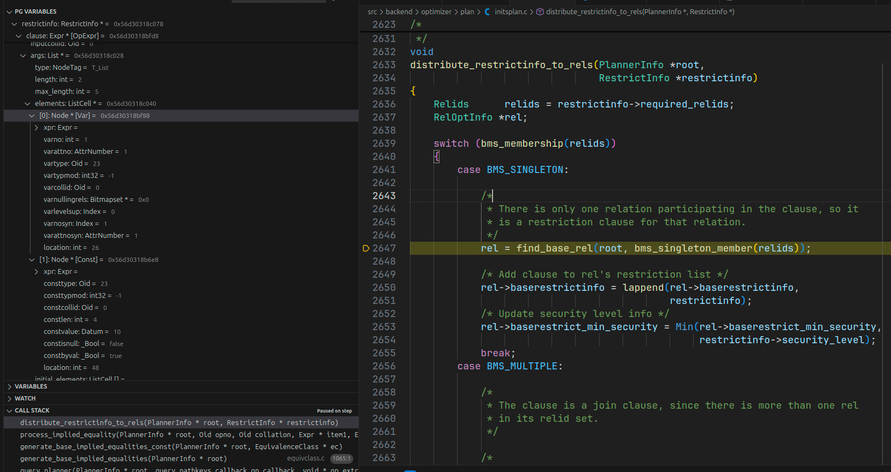

19. Все что мы делаем - получаем `RelOptInfo`, столбец которого используется в условии, и добавляем его в список `baserestrictinfo` - список RESTRICTION CLAUSE этого отношения, т.е. условий фильтраций кортежей.
    Эти условия будут применяться при базовом сканировании таблицы (а может и вообще для использования индексом).

    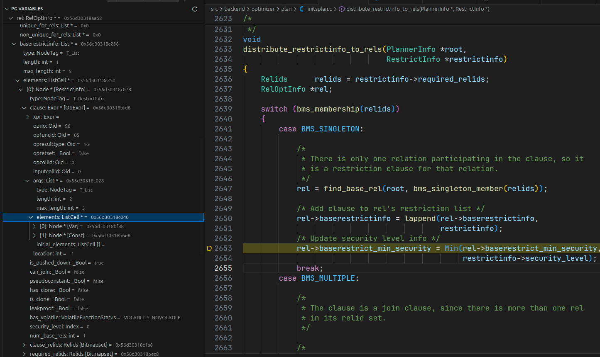

20. Возвращаемся обратно в `generate_base_implied_equalities_const` и начинаем обрабатывать следующий столбец.
    Единственный оставшийся - `b.x`. Для него мы создаем `b.x = 10`.

    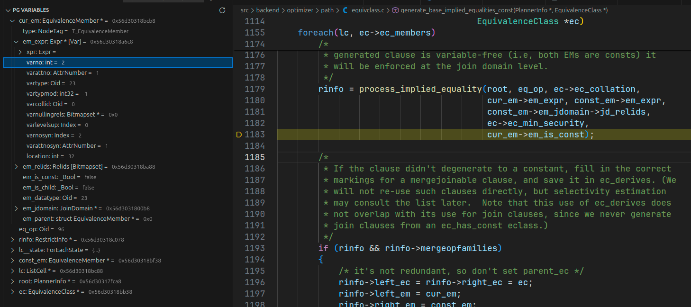

21. Но тут мы не будем идти внутрь и просто сделаем 1 шаг (step over).
    Если посмотрим в `baserestrictinfo` отношения с `relid = 2` (таблица `b`), то увидим, что там теперь 1 условие - `b.x = 10`

    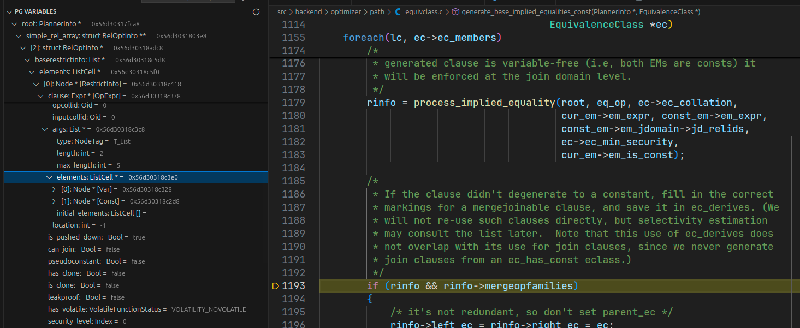

22. Последний член - это сама `10`. Но его мы не обрабатываем, это бессмысленно - пропускаем.
    На этом вывод условий закончен.

---

Теперь стоит рассмотреть, где это может быть использовано. Для примера можно использовать тот же самый запрос. Без индексов у нас будет NestedLoop с 2 SeqScan:

```text
postgres=# explain SELECT * FROM a JOIN b ON a.x = b.x WHERE a.x = 10;
                          QUERY PLAN                           
---------------------------------------------------------------
 Nested Loop  (cost=0.00..85.89 rows=169 width=8)
   ->  Seq Scan on a  (cost=0.00..41.88 rows=13 width=4)
         Filter: (x = 10)
   ->  Materialize  (cost=0.00..41.94 rows=13 width=4)
         ->  Seq Scan on b  (cost=0.00..41.88 rows=13 width=4)
               Filter: (x = 10)
(6 rows)
```

Но стоит нам добавить индексы на столбцы `x`, то план будет использовать индексы.

```text
postgres=# EXPLAIN SELECT * FROM a JOIN b ON a.x = b.x WHERE a.x = 10;
                                  QUERY PLAN                                  
------------------------------------------------------------------------------
 Nested Loop  (cost=0.31..511.05 rows=169 width=8)
   ->  Index Only Scan using a_x_idx on a  (cost=0.15..36.38 rows=13 width=4)
         Index Cond: (x = 10)
   ->  Index Only Scan using b_x_idx on b  (cost=0.15..36.38 rows=13 width=4)
         Index Cond: (x = 10)
(5 rows)
```

> Я выставил `enable_material = off` и `enable_bitmapscan = off`, т.к. в первоначальном плане использовался Bitmap Heap/Index Scan и Material узлы

Можно заметить, что в плане использовался фильтр `b.x = 10`, хотя мы его прямо не указывали.
Тут мы переходим на последний этап работы - к функции `generate_base_implied_equalities`.
Она занимается тем, что выводит новые выражения с помощью уже существующих классов эквивалентности.

1. В функции `generate_base_implied_equalities` мы проходим по всем EC и для каждого вызываем `generate_base_implied_equalities_const` (т.к. у в нашем EC была константа)

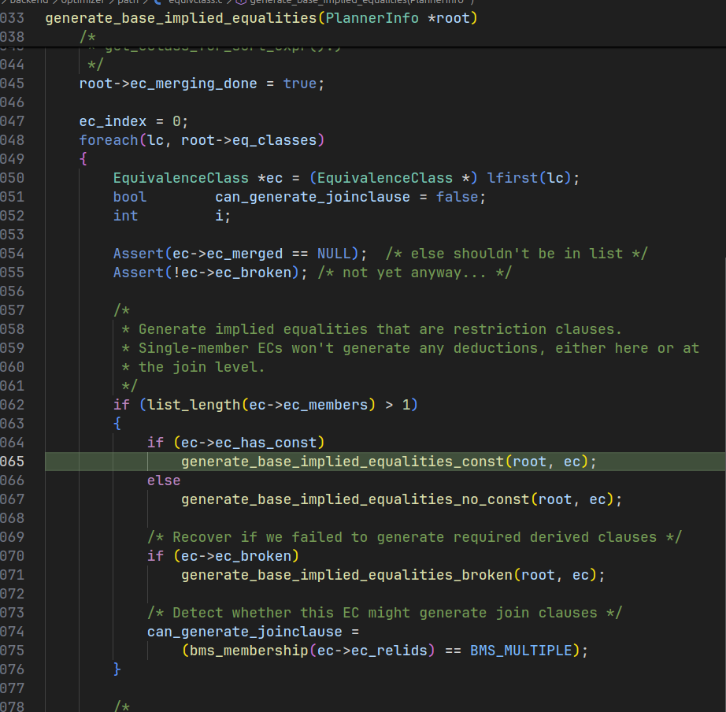

2. Внутри же логика довольно тривиальна - находим константу среди всех EM, а далее проходим другим EM и создаем выражение равенства с этой константой

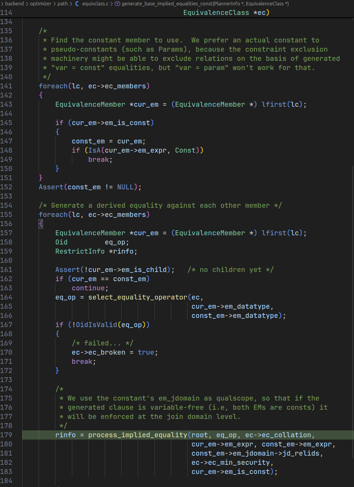

3. Само же выражение добавляется в функции `distribute_restrictinfo_to_rels`. Это общая функция, которая вызывается не только на нашем пути (обработка выведенных условий), но и в других местах логики.

Внутри нее проверяется 2 случая - `RestrictInfo->required_rels` имеет 1 или несколько элементов (т.е. сколько отношений требуется для вычисления выражения).
Мы натыкаемся на 1 случай, т.к. выражение вида `XXX = CONSTANT` (нашли эту константу в EC).
Другой случай наступает когда в выражении имеется несколько отношений. Такие выражения являются условиями JOIN'ов.

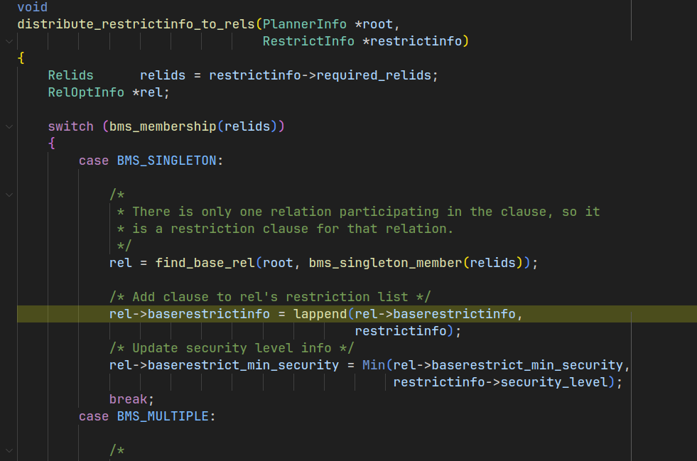

Теперь нам доступно это выражение в списке ограничений для этого отношения из любого участка кода.

Таким образом, внутреннее представление запроса при переводе в текстовый вид следующее:

```sql
SELECT * FROM a JOIN b ON a.x = b.x WHERE a.x = 10 AND b.x = 10
```

А из этого можно заключить, что мы можем использовать индекс.

---

Сейчас мы говорили о EC, в которых есть константы - мы создавали `mergejoinable` выражения с этими константами и все было было просто.
Но что если в EC нет констант? Тогда вывода условий не происходит?

Внимательные уже поняли куда смотреть. Вернемся к `generate_base_implied_equalities`.
Мы пошли по первой ветке (`ec->ec_has_const == true`), но есть и вторая.
Вот она и отвечает за вывод возможных равенств.

Но опять внимательные могут заметить, что в этом случае сложность будет квадратичная (каждый с каждым).
При большом количестве членов в множестве производительность может сильно упасть (причем не только на этом этапе, но и дальше, когда эти выражения будут обрабатывать).

Поэтому было принят такой подход: мы выводим выражения равенства только для одного и того же отношения и при этом для текущего элемента генерируем выражение для предыдущего увиденного.

Визуализируя:

```text
{  a.x   a.y   a.z   b.x   a.e   c.x  }

a.x = a.y
a.y = a.z
a.z = a.e
```

Давайте посмотрим как это выполняется на запросе: `SELECT * FROM a JOIN b ON a.x = b.x WHERE b.x = a.y AND b.x = a.z`.
Точку останова поставим прямо на входе в `generate_base_implied_equalities_no_const`.

1. Когда мы попадаем в эту функцию, то в нашем множестве уже можно увидеть все 4 столбца.

    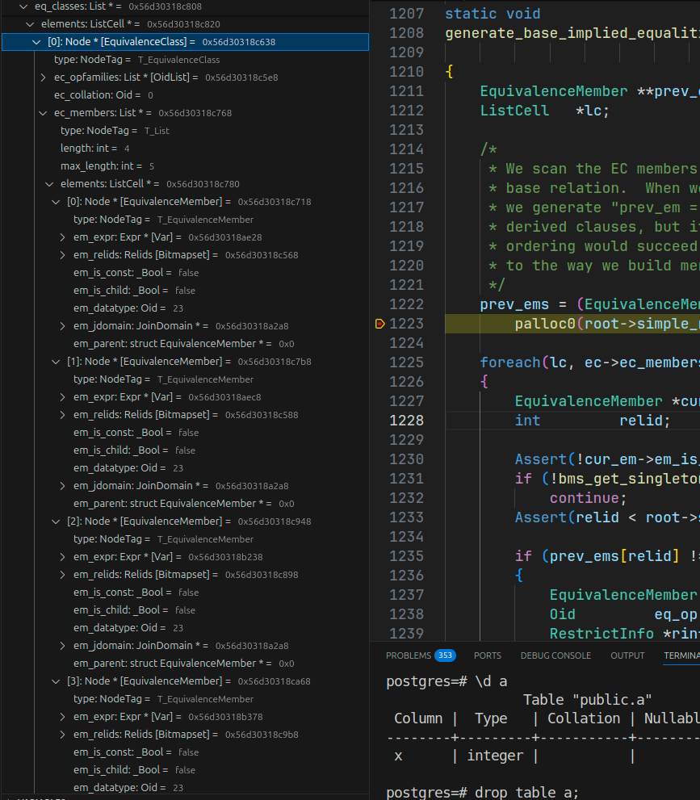

    Мы остановились на создании переменной `prev_ems`. В ней будут хранится последние увиденные нами `em`, а индексом является `relid` отношения, которому этот `em` принадлежал (мы только последние обрабатываем).

2. Первый `em` - это `a.x`. Но так как это отношение мы не обрабатывали, то просто сохраняем этот элемент в массиве под индексом 1.
    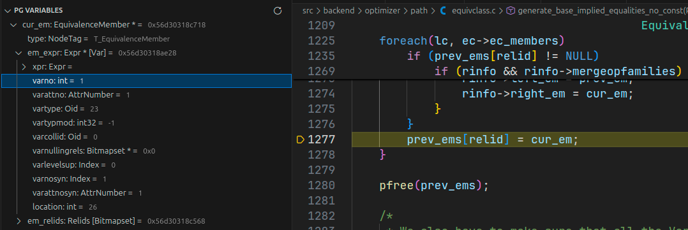

3. Далее нам попадается столбец `b.x`. Но его отношение ранее мы тоже не обрабатывали, поэтому просто сохраняем в массиве.
    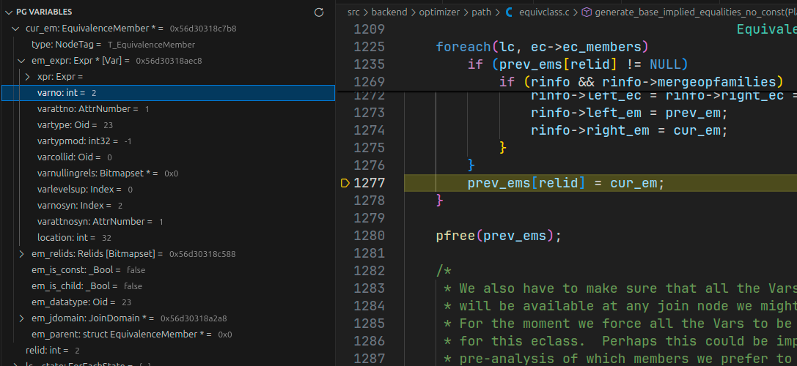

4. Но вот третьим мы обрабатываем столбец `a.y`, а значит должны вывести для него `a.x = a.y`. И действительно, мы проходим условие и доходим до вызова `process_implied_equality`.
    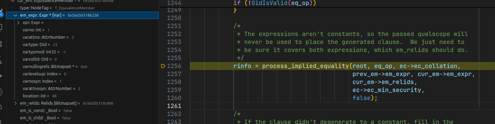

5. Спускаемся в вызов и доходим до вызова `distribute_restrictinfo_to_rels` (почти до конца).
   На этом моменте у нас уже есть готовый `RestrictInfo`, который и представляет условие.

    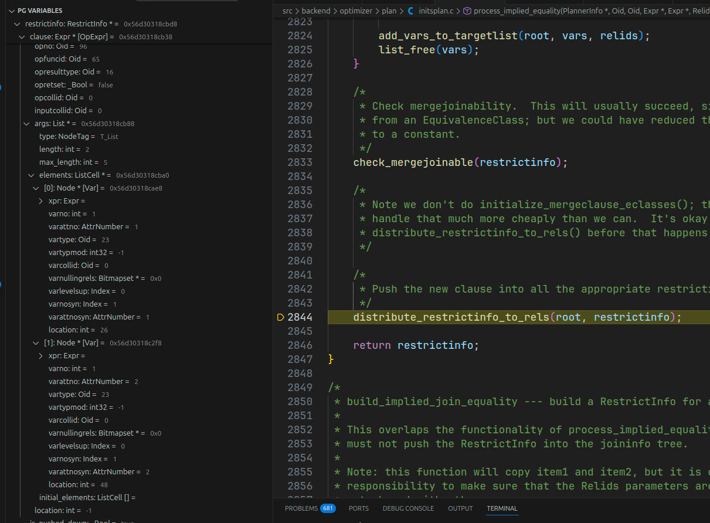

6. Но и это еще не все - мы заходим внутрь `distribute_restrictinfo_to_rels`, чтобы поместить это выражение в нужный узел.
    Ранее мы его уже видели в действии, когда выводили условия с *константами*. Там мы шли по условие `BMS_SINGLETON`, т.е. 1 элемент в множестве.
    Как думаете по какому пути мы пойдем сейчас?
    Правильно по тому же самому - в данном выражении участвуют столбцы, которые принадлежат одному и тому же отношению.
    Поэтому просто добавляем условие в него.

    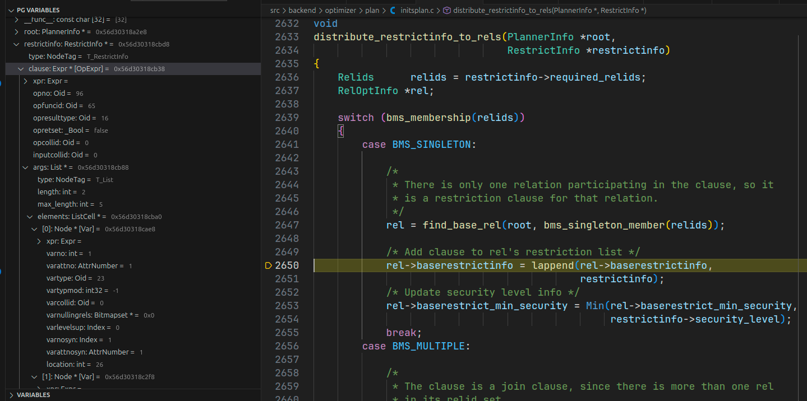

7. Теперь мы возвращаемся обратно в `generate_base_implied_equalities_no_const` и передвигаемся к следующему EM - `a.z`.
   На этот раз нам нужно создать условие равенства `a.y = a.z`, т.к. предыдущий EM был `a.y`.

   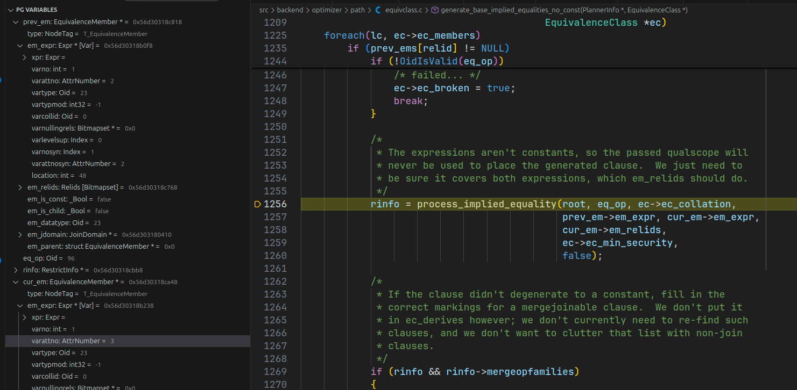

8. Когда мы вернемся обратно в `query_planner`, то увидим в наших `RelOptInfo` все сгенерированные условия:
    

---

Вы могли заметить, что когда мы передаем конфликтующие равенства в условиях, то весь узел плана заменялся на пустой `Result`.
Сейчас мы рассмотрим почему это происходит на запросе: `SELECT * FROM a WHERE a.x = 10 AND a.x = 5`.

Нам нужно будет поставить точку останова на входе в `process_implied_equality` - тогда, когда выводятся выражения с использованием классов эквивалентности.

1. Запускаем запрос и останавливаемся в этой точке останова.
   Если посмотрим на `item1` и `item2`, то поймем, что выведено условие `a.x = 10`.
   
   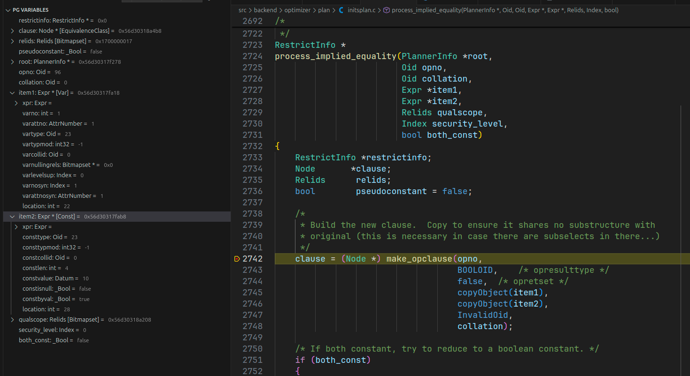

2. Сделаем несколько шагов до конца и видим, что это условие пошло в `baserestrictinfo` таблицы `a`.

    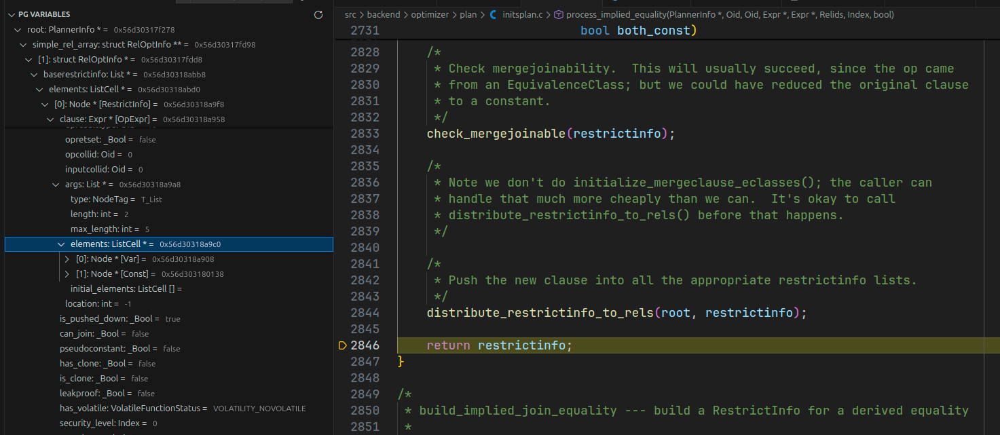

3. Теперь продолжаем выполнение (до следующей точки останова, F5) и опять останавливаемся в начале этой функции.
   Но на этот раз нам передали обе константы - `10` и `5`

   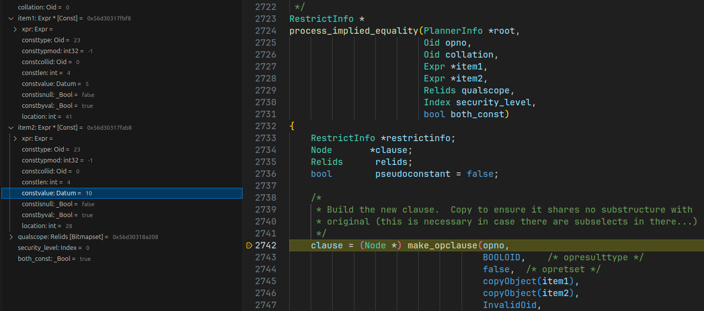

4. На этот раз мы делаем 1 шаг и останавливаемся на условии `if (both_const)`.
    Как можете догадаться, эта переменная равна `true`, поэтому мы заходим в нее.
    В ней же мы пытаемся вычислить это выражение в функции `eval_const_expressions`.
    Я не буду показывать как работает эта функция, поэтому сразу результат - нам вернулась константа.

    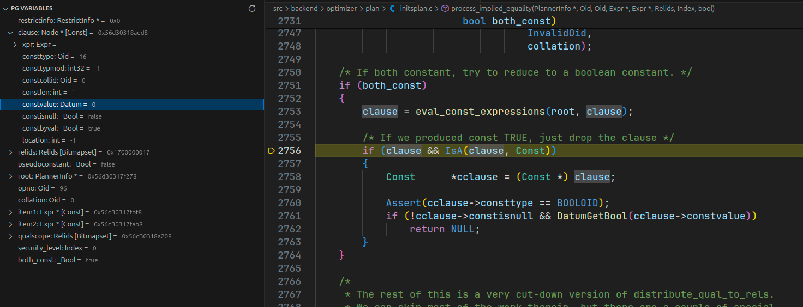

5. Если посмотрим повнимательнее, то поймем, что перед нам `FALSE`: `consttype = 16` (`BOOLOID`) и `constvalue = 0`.
    Путь обработки подобных выражений (псевдоконстантных, в которых не используются другие отношения) немного отличается от того, что мы видели, но не сильно.

6. Возвращаемся из `generate_base_implied_equalities` и видим, что в `baserestrictinfo` у нас находятся 2 условия: `a.x = 10` и `FALSE`


Таким образом, запрос представляется так: `SELECT * FROM a WHERE a.x = 10 AND FALSE` (хотя планы выполнения отличаются, но функционально идентичны)

---

У классов эквивалентности много других задач и используются во многих местах.
За 1 раз всех их не описать, поэтому закончим на этом.
