# JoinDomain

`JoinDomain` - это множество отношений, которые соединяются друг с другом INNER JOIN.

В комментарии дается другое определение - это область, в которой мы можем делать выводы с помощью EquivalenceClass'ов.

```c
typedef struct JoinDomain
{
	pg_node_attr(no_copy_equal, no_read, no_query_jumble)

	NodeTag		type;

	Relids		jd_relids;		/* all relids contained within the domain */
} JoinDomain;
```

Также как и EquivalenceClass создается в `deconstruct_jointree`.

Для всего запроса создается один верхнеуровневый JoinDomain (для всего запроса) - содержит все отношения из запроса.
Изначально он пуст, но заполняется последовательно, по мере обхода дерева JOIN'а функцией `deconstruct_recurse`.
На вход ей передается родительский JoinDomain и изначально он равен top_domain, т.е. верхнеуровневому.

При посещении очередного узла мы добавляем это отношение в родительский JoinDomain. Но все меняют не-INNER JOIN'ы - LEFT/RIGHT/ANTI/FULL OUTER. Такие в общем случае называют OUTER JOIN'ы, сокращенно OJ.

Рассмотрим как обрабатываются JOIN'ы в контексте JoinDomain'ов. Для начала, у каждого JOIN'а есть левая и правая части - как в самом запросе.
Почему мы их различаем станет понятно, если заметить, что не INNER JOIN может превратить одну часть в NULL. Как мы помним, при соединении таблиц мы создаем новый EquivalenceClass (из столбцов в выражении). Но вот если используется OUTER JOIN, то из этого выражения мы не можем заключить, что в результирующей выборке эти столбцы могут быть NULL, а сравнение с NULL всегда ложно.

Самый простой случай - INNER JOIN. В этом случае, обе части запроса используют один и тот же JD и мы всегда можем заключить, что значения столбцов после JOIN'а будут равны друг другу. То есть, имея родительский JD - `parent_jd` мы получим следующую картину (в узлах JoinTreeItem'ы).

```text
          INNER JOIN  <---- parent_jd
         /          \
        /            \
       /              \
      /                \
     /                  \
OTHER <- parent_jd       OTHER <- parent_jd
```

Другой случай - не-INNER JOIN. Тогда мы не можем обеим частям так просто назначить один и тот же JD. Поэтому в Postgres сделали такой ход - мы создаем отдельные JoinDomain'ы для каждой части, которые могут стать NULL. Но при этом сам JoinDomain узла не-INNER JOIN уже не может принадлежать parent_domain, т.к. в противном случае мы можем заключить, что все столбцы в условии не-INNER JOIN будут равны столбцам из левого JOIN DOMAIN.

Для LEFT JOIN картина будет следующей:

```text
          LEFT  JOIN  <---- child_jd
         /          \
        /            \
       /              \
      /                \
     /                  \
OTHER <- parent_jd       OTHER <- child_jd
```

Я задался вопросом почему узлу самого JOIN'а задается `child_jd`, а не `parent_jd`?
Ведь если мы имеем, например, запрос `SELECT * FROM a LEFT JOIN b ON a.x = b.x`, то в таком случае он не должен измениться, то есть все будет работать корректно.
Да даже если добавим еще выражений: `SELECT * FROM a LEFT JOIN (SELECT * FROM b WHERE b.x = 5) b ON a.x = b.x WHERE a.x = 4`.
Такое дерево должно выглядеть так:

```text
          LEFT  JOIN  (child_jd)
           a.x = b.x
         /          \
        /            \
       /              \
      /                \
     /                  \
     a (parent_jd)       b (child_jd)
  a.x = 4              b.x = 5
```

Даже если бы мы подставили `parent_jd` в LEFT JOIN, то ничего не произошло бы: `b.x = 5` все равно находится в своем JOIN DOMAIN (`child_jd`), поэтому у нас получится 2 класса эквивалентности: `{a.x, 5, b.x}` и `{a.x, 4}`.
Но это только на первый взгляд. И правда: в коде я заменил `child_domain` на `parent_domain` (`src/backend/optimizer/plan/initsplan.c:948`, функция `deconstruct_recurse`) и запустил регрессионные тесты.
Из всего множества тестов повалились только 2 и все они связаны с LEFT JOIN. Вот дифф одного из тестов:

```text
 EXPLAIN (COSTS OFF)
 SELECT t1.a, t1.c, t2.b, t2.c FROM (SELCET * FROM prt1 WHERE a = 1 AND a = 2) t1 RIGHT JOIN prt2 t2 ON t1.a = t2.b, prt1 t3 WHERE t2.b = t3.a;
-                    QUERY PLAN                    
---------------------------------------------------
- Hash Left Join
-   Hash Cond: (t2.b = a)
-   ->  Append
-         ->  Hash Join
-               Hash Cond: (t3_1.a = t2_1.b)
-               ->  Seq Scan on prt1_p1 t3_1
-               ->  Hash
-                     ->  Seq Scan on prt2_p1 t2_1
-         ->  Hash Join
-               Hash Cond: (t3_2.a = t2_2.b)
-               ->  Seq Scan on prt1_p2 t3_2
-               ->  Hash
-                     ->  Seq Scan on prt2_p2 t2_2
-         ->  Hash Join
-               Hash Cond: (t3_3.a = t2_3.b)
-               ->  Seq Scan on prt1_p3 t3_3
-               ->  Hash
-                     ->  Seq Scan on prt2_p3 t2_3
-   ->  Hash
-         ->  Result
-               One-Time Filter: false
-(21 rows)
+        QUERY PLAN        
+--------------------------
+ Result
+   One-Time Filter: false
+(2 rows)
```

Можете заметить, что весь план заменен на возвращение пустого результата.
Когда я увидел это, то подумал, что стало лучше (мы JOIN'им с пустым узлом), но это не так - не забывайте, что перед нами **LEFT** JOIN.
В данном случае, это значит, что мы должны получить всю левую часть с `NULL`'ами в правой, а вместо этого нам ничего не возвращается.

Почему так? Вернемся к диаграмме дерева JOIN'а, который я ранее представил.
Он правильный только с точки зрения логики (логическое представление), но реализация иная.
Дерево представляется узлами `JoinTreeItem`, которые внутри себя хранят сами узлы дерева (в поле `jtnode`) из самого дерева запроса (`Parse`).

Так вот, ошибка в том, что мы условия фильтров (с константами) *опустили на уровень сканирования таблиц*, в действительности это не так.
Если посмотрим на реализацию, то увидим, что за узлы отношений отвечает структура `RangeTblRef`, но она не хранит информацию о фильтрах.
Эта информация хранится в узлах `JoinExpr` (поле `quals`), либо `FromExpr` (поле `quals`).
Поэтому правильное представление дерева (упор на условия) будет следующим:

```text
          LEFT  JOIN  (child_jd)
     a.x = b.x AND b.x = 5
         /          \
        /            \
       /              \
      /                \
     /                  \
    a (parent_jd)       b (child_jd)
  a.x = 4
```

Вот теперь и можно заметить, что выставление нужного JOIN DOMAIN в узле JOIN'а влияет на события - условие `b.x = 5` теперь относится к самому JOIN'у.
В таком случае, если у JOIN'а будет `parent_jd`, то эта `5` уйдет в него и испортит всю малину - будет конфликтовать с другой константой `4`.
Но если присмотреться, то, наоборот, передать `4` для `b.x = 4` уже корректно для LEFT JOIN. И в самом деле, если мы выбираем все `b.x = 5`, то при условии `ON a.x = b.x WHERE a.x = 4` окажется, что правая сторона (столбцы `b`) пустая.

Но хватит размышлять, давайте посмотрим, что в коде.
Сперва, мы посмотрим на оригинальный код, то есть как происходит все сейчас.
Проверять все это будем на запросе `SELECT * FROM a LEFT JOIN (SELECT * FROM b WHERE b.x = 5) b ON a.x = b.x WHERE a.x = 4`.

1. Первое, что проверим - какие классы эквивалентности будут созданы. Для этого поставим точку останова в `deconstruct_recurse`.
    После запуска мы попадем на `FromExpr`. Он нам не нужен, поэтому пропускаем (F5).
    А вот второй узел - это `JoinExpr`, то что нам нужно. И внутри мы попадем под случай `JOIN_LEFT`.
    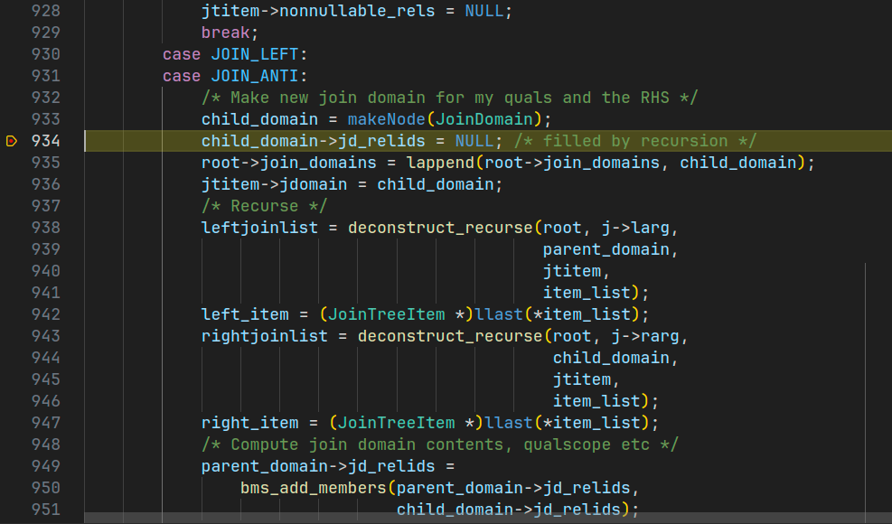

    Можем заметить, что мы создаем новый Join Domain (`child_domain`) - это тот самый JD для nullable части (правая сторона JOIN'а и сам JOIN).

2. Далее, начинаем жонглировать Join Domain'ами. Вначале, мы обрабатываем левую часть и в нее передаем `parent_domain`. В нашем случае, это будет `top_level_domain` (т.к. только 1 JOIN).
   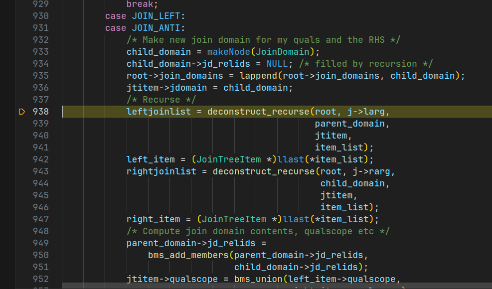

3. Внутри же у нас простой `RangeTblRef` и все, что он делает - добавляет себя в список отношений родительского домена (т.е. новых он не создает)

    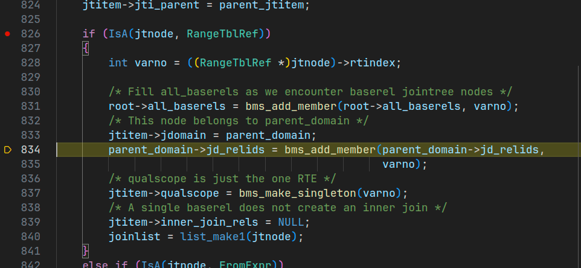

4. Возвращаемся обратно и переходим уже к правой части JOIN'а, его nullable части.
   В нее мы передаем уже новый Join Domain (`child_domain`).

    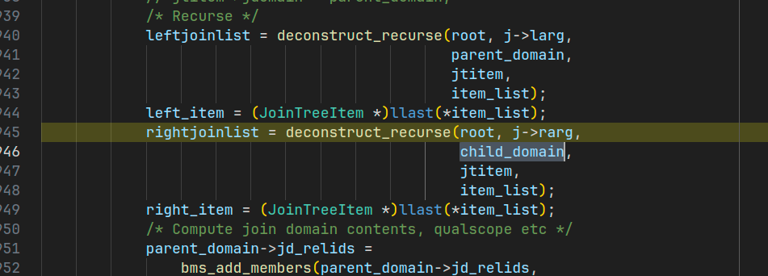

5. Внутри все то же, что и на 3 шаге - добавляем себя в родительский JD.
   Эту часть опустим и пойдем выше (обратно) по стеку в `deconstruct_jointree` (откуда вызвали сам `deconstruct_recurse`).
   Посмотрим какие теперь у нас JD есть.
   И их 2: первый - top level, второй - дочерний (для nullable части LEFT JOIN'а)

    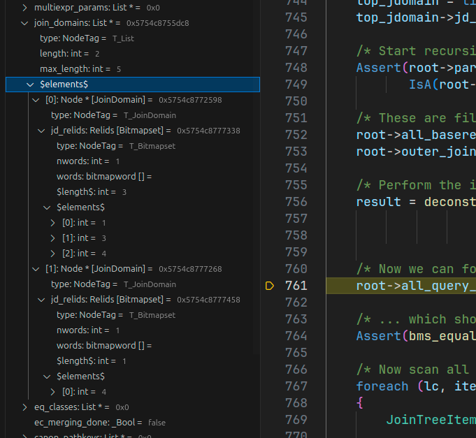

6. Далее идет часть распределения условий из каждого `JoinTreeItem`'а. Здесь создаются изначальные классы эквивалентности.
   Но ранее, мы фокусировались только на `foreach` цикле с `deconstruct_distribute` внутри.
   Тогда это было справедливо - все логика была там, но не сейчас. После этого цикла идет другой, который обрабатывает все OUTER JOIN'ы (LEFT/RIGHT/FULL и т.д.)
   Вот сейчас мы на него и натыкаемся.
   Для начала посмотрим какие классы эквивалентности у нас есть на данный момент.

   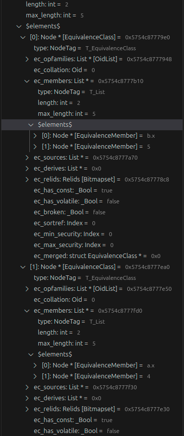

   Можем видеть, что у нас есть 2 класса: `{ b.x, 5 }` и `{ a.x, 4 }`. Если бы это был INNER JOIN, то сейчас наблюдали 1 класс: `{ b.x, 5, a.x, 4 }`.
   Почему 2, а не 1? Из-за OUTER JOIN'а - только сейчас мы начинаем обрабатывать условия из всех таких JOIN'ов.

7. Выходим обратно в `query_planner` и переходим к `reconsider_outer_join_clauses`. Она будет заниматься обработкой OUTER JOIN'ов.
   Внутри же мы сразу попадаем в цикл обработки условий LEFT JOIN'ов `root->left_join_clauses`.
   Первое (и единственное) условие, которое мы обрабатываем, - это условие LEFT JOIN'а - `a.x = b.x`

   

8. Спускаемся внутрь `reconsider_outer_join_clause`. Здесь имеется та самая логика, о которой я говорил - передаем константу из левой (не NULL части) в условие правой части.
    Первое, что мы делаем - определяем какое выражение OUTER (левая, не NULL), а какая INNER (правая, NULL).
    Так как все выражения приведены к каноничному виду и эта же самая функция используется как для LEFT, так и для RIGHT JOIN'ов, то эта информация передается параметром.
    Можем видеть, что действительно: OUTER - `a.x`, INNER - `b.x`

    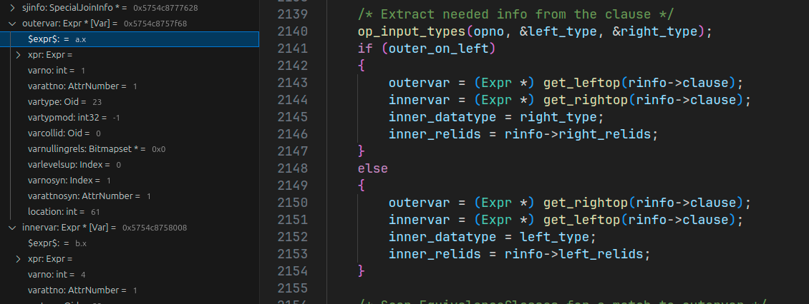

9.  Теперь переходим к логике передачи константы. Что мы здесь делаем? Находим класс эквивалентности, которому принадлежит OUTER часть, а затем для каждой константы в этом классе создаем выражение `INNER = CONST` (правое - это константа из класса OUTER части).
    Нахождение класса эквивалентности тривиально - выполняем проверку с помощью `equal`.
    Первый класс - это NULLable JD, в нем нет `a.x`, поэтому пропустим.

    

10. Но вот следующий класс уже подходит и как раз его первый элемент - это `a.x`

    

11. Когда мы нашли подходящий класс, то начинаем перебирать все константы внутри него.
    Как уже сказал, первый элемент - это сам столбец, поэтому отлетает.
    Но вот второй - это уже константа `4`. С ней мы и будем создавать выражение.

    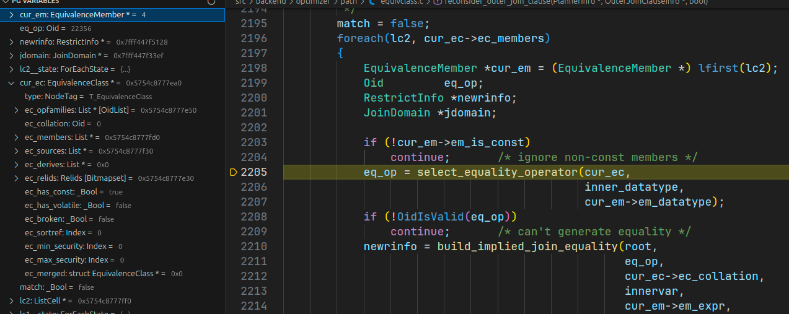

12. Теперь, мы создаем `RestrictInfo` для этого выражения и обрабатываем.
    Но в начале нам необходимо найти какому JD это выражение будет принадлежать.
    Это важно так как далее мы запустим ту же логику, что и для обычных выражений - `process_equivalence`.
    Но проблема в том, что мы взяли константу из одного EC и добавили ее к выражению из другого EC.
    То есть во время работы мы можем наткнуться на EC, который эту константу содержал.
    Без механизма JD мы бы просто объединили эти EC в один и тогда могли создать некорректные выражения.
    Посмотрим какой JD мы нашли.

    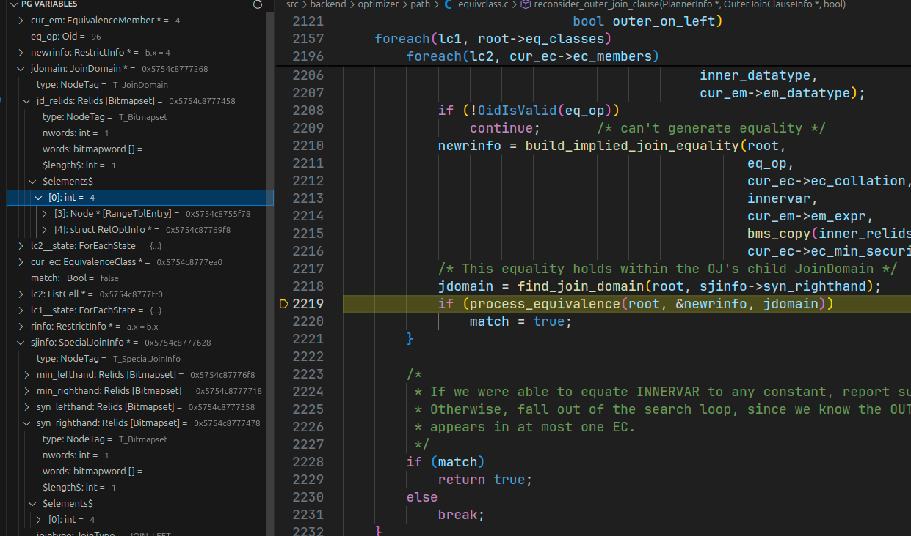

    > Можно заметить, что хоть в данной функции и есть проверка на константу - нет проверки на JD.
    > Это как раз таки из-за того, что мы и делаем эту опасную вещь - передаем константу из одного JD в другой.

13. Последний шаг - `process_equivalence`. Внутри мы также находим EC, которым принадлежат обе части выражения. Вначале (первая итерация цикла) мы находим EC для `b.x`. Но вот далее мы переходим к 2 EC.
    Как помним мы взяли эту константу (`4`) оттуда. Как мы себя поведем встретив ее?
    Объединим оба класса эквивалентности?
    Когда мы натыкается на EM этой константы, то не проходим условие на равенство JD и переходим к `continue`.

    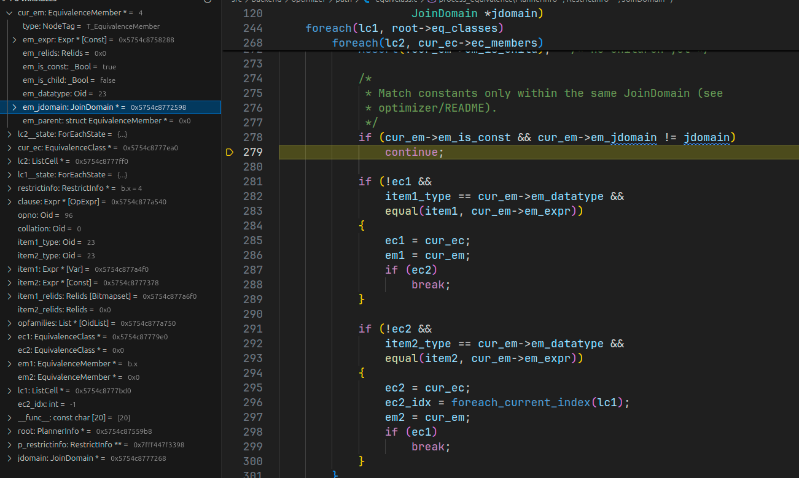

    Вот таким образом мы предотвратили объединение двух разных JD и не дали заключить, что `a.x = 5 AND a.x = 4`.

14. В конце мы добавляем эту константу в найденный EC. И теперь в нем 3 элемента: `{ b.x, 5, 4 }`

    

15. Но это еще не все. Вернемся обратно в `reconsider_outer_join_clauses`.
    Что мы сделали? Оптимизировали список условий и теперь, нам нет необходимости выполнять настоящий JOIN, т.к. можем просто применить фильтр по константе.
    Но вот так взять и удалить `a.x = b.x` мы не можем - можем получиться JOIN вообще без условий и это плохо скажется во время нахождения порядка соединения отношений (честно, пока не знаю каким образом, но это прямо описано в комментариях).
    Поэтому сейчас мы добавляем константное `TRUE` условие.
    Дополнительно делаем его похожим на старое условие: требуем для вычисления те же отношения (иначе можно будет изменить порядок соединений как угодно).

    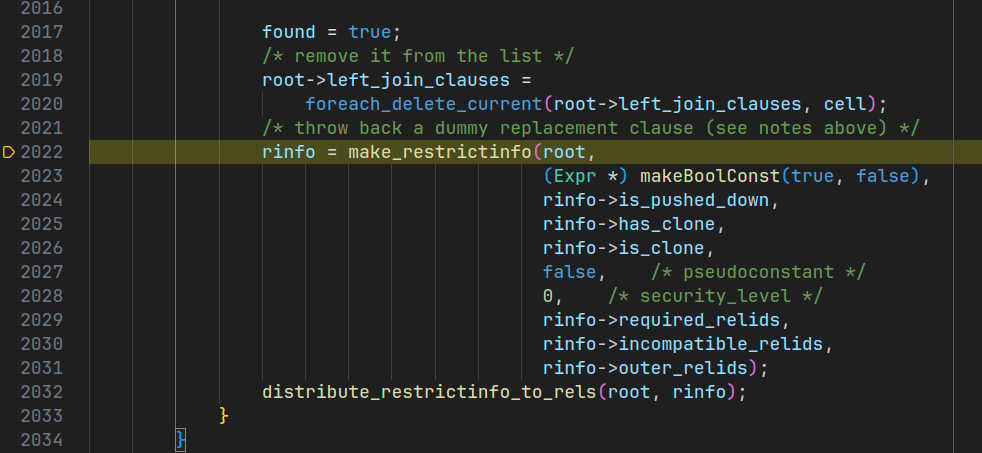

---

Теперь можно понять для чего были созданы эти JOIN DOMAIN - предотвращение объединения классов эквивалентности по константам из разных доменов.
Если этого не делать, то в результате мы сгенерируем заведомо некорректные выражения.
Напомню, что при обработке условий мы создаем классы эквивалентности из условий равенства, а затем генерируем уже новые условия равенства из элементов EC.

Без подобного разделения у нас останется один верхнеуровневый класс (объединили т.к. константы разных EC из разных доменов равны), который содержит разные константы (они вычислились в FALSE).
А так как он применяется ко всему запросу, то получается есть условие выборки `WHERE FALSE` -> ничего в ответе нет.

В принципе, сейчас уже можно понять логику `FULL OUTER JOIN`. Если раньше мы `parent_jd` передавали в левую часть, потому что она всегда будет равна сама себе (т.е. не зануляется), а для правой создавали свой, т.к. она могла.
То сейчас занулиться могут обе части, поэтому для каждой мы создаем свой JD.
Но и это еще не все. В LEFT JOIN мы использовали 2 JD - `parent_jd` (получали) для левой части и `child_jd` (создавали) для правой части.
Можно сказать, что в результате мы получали новый мир, который состоял из (всегда существующей, не NULL) левой части и (исчезающей, NULLable) правой части.
Я бы так это изобразил:

```text

        a      LEFT JOIN      b
    |||||||||             |||||||||
    |||||||||             |       |

```

То есть мы всегда можем полагаться, что столбцы левой части всегда будут иметь те же значения, что и создавшее их отношение.
Но для правой части не это не всегда, ведь они могут вернуть NULL.
Поэтому мы и создали новый JD для такого случая.

Но когда мы рассматриваем `FULL OUTER JOIN`, то оказывается, что занулиться могут обе части.

```text

          a     FULL OUTER JOIN     b
      |||||||||                 |||||||||
      |||||||||                 |       |
      |       |                 |||||||||

```

Что делать в этом случае? Тогда мы создаем не 1 (как раньше), а целых 3 домена: левая часть, правая часть и сам JOIN.
Для левой и правой части понятно - у каждой своя область существования, но почему для самого JOIN'а свой JD, ведь в LEFT JOIN мы использовали дочерний?

Здесь также все просто - оптимизации. Благодаря тому, что в `child_jd` было наше условие `a.x = b.x` мы смогли заключить, что вся правая часть не нуждается в вычислении (оптимизация INNER = CONST, `b.x = 5 AND b.x = 4`).
Это вполне корректная оптимизация, но в случае с FULL OUTER JOIN она не сработает, т.к. для этой оптимизации нам нужны INNER и OUTER столбцы, но строго таковых нет - каждый столбец может стать NULL.

Но, также остался последний вопрос - к какому домену относится сам JOIN? Здесь все просто - для него создается свой домен.
Таким образом, мы получаем следующую логику.

```c
void
deconstruct_recurse()
{
    JoinExpr *j;
    switch (j->jointype)
    {
        case JOIN_FULL:
            /* The FULL JOIN's quals need their very own domain */
            fj_domain = makeNode(JoinDomain);
            jtitem->jdomain = fj_domain;

            /* Recurse, giving each side its own join domain */
            child_domain = makeNode(JoinDomain);
            leftjoinlist = deconstruct_recurse(root, j->larg,
                                               child_domain,
                                               jtitem,
                                               item_list);

            child_domain = makeNode(JoinDomain);
            rightjoinlist = deconstruct_recurse(root, j->rarg,
                                                child_domain,
                                                jtitem,
                                                item_list);
    }
}
```

Например, на запрос `SELECT * FROM (SELECT * FROM a WHERE a.x = 10) a FULL JOIN (SELECT * FROM b WHERE b.x = 11) b ON a.x = b.x` мы получим следующий план.

```text
           QUERY PLAN           
--------------------------------
 Hash Full Join
   Hash Cond: (a.x = b.x)
   ->  Seq Scan on a
         Filter: (x = 10)
   ->  Hash
         ->  Seq Scan on b
               Filter: (x = 11)
```

То есть все условия сохранились, несмотря на то, что константы разные.
Если же посмотрим на созданные классы эквивалентности, то получим: `{ a.x, 10 }` и `{ b.x, 11 }`.

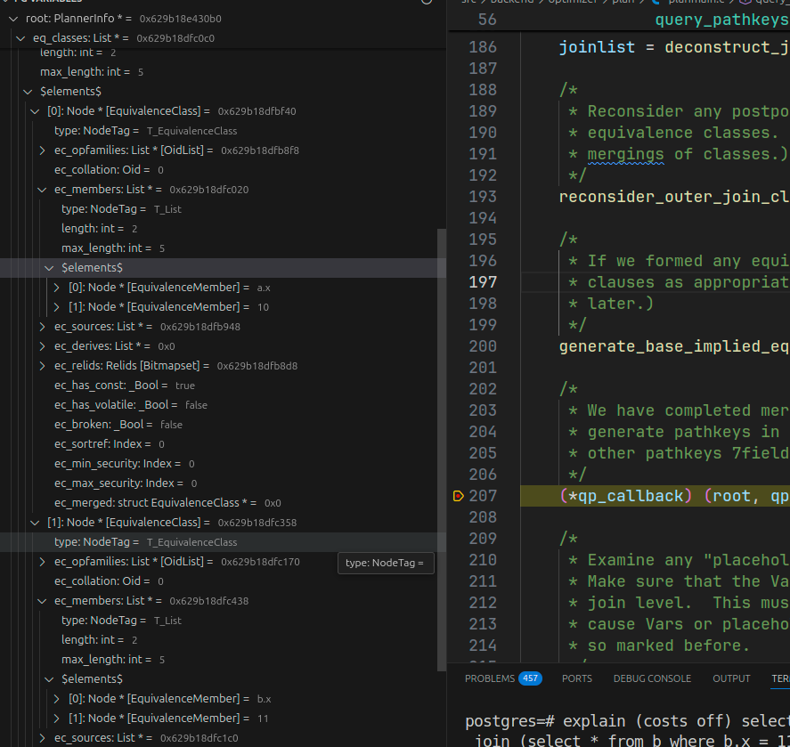
